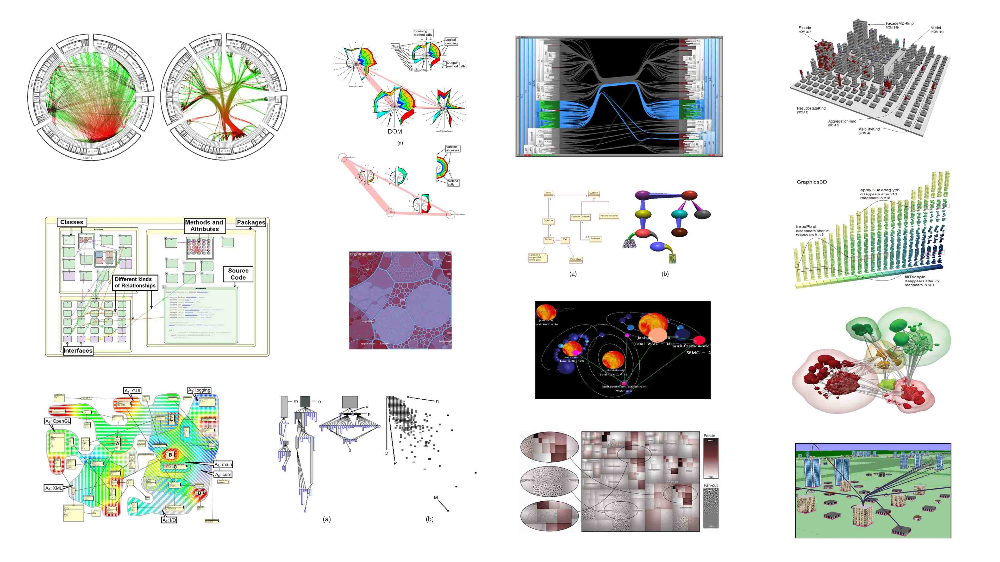
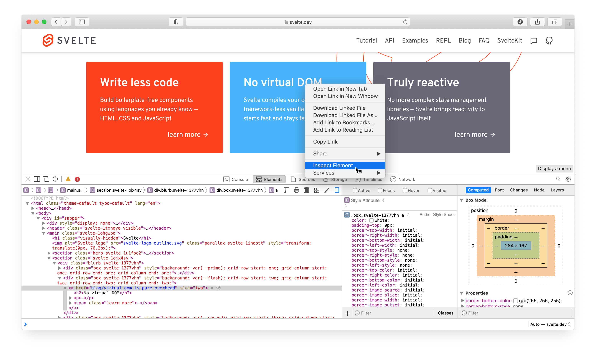
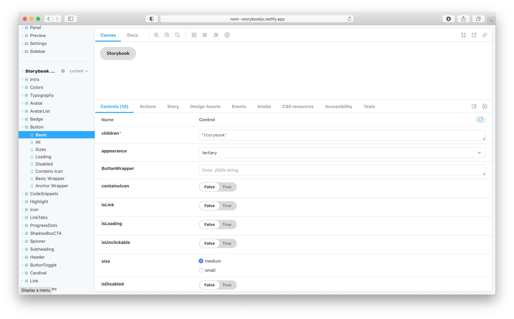
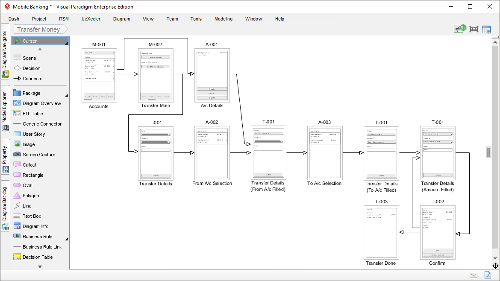
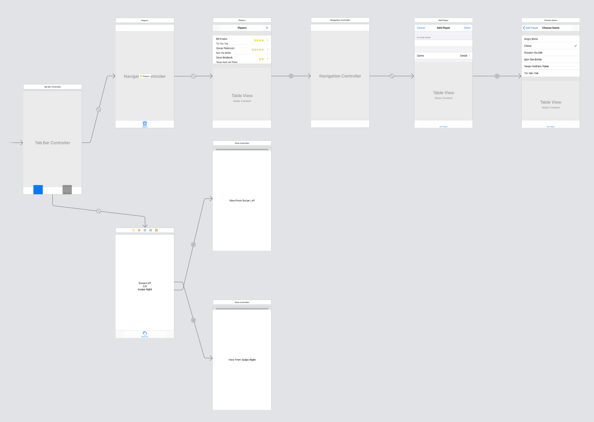

## Prior art

Documenting software involves many different aspects. Each of them brings inherent problems for which researchers have proposed many solutions over the years. In this chapter we cover literature exposing 4 of them: 

- Automation as a solution for updating & maintenance
- Visual representation of software
- Graph navigation as an interaction technique
- Prescriptive theory to counter irrational design choices

In addition to the literature, an overview is given covering features and missing features of 4 related tools that are used in the industry:

- Webkit inspector
- Storybook JS
- Visual paradigm
- InterfaceBuilder Storyboards

### Literature

#### Automated documentation

The creation and maintenance of documentation is a hard and time-consuming task. A survey by Forward et al. [^Forward 2002] shows that its "participants agree that documentation tools should seek to better extract knowledge from core resources" like source code.

Various attempts have been made to use this knowledge for documentation purposes. Antoniol et al. [^Antoniol 2002] and Marcus et al. [^Marcus 2003] discuss how to extract knowledge from source code to automatically couple snippets from free-text documents with their corresponding source code fragments. 

Another technique is to generate documentation text completely using AI. Barone et al. [^Barone 2017] scrape Github to collect python functions and their corresponding documentation. This data can then be used to automatically convert code to a summarising text using a neural attention model as is shown by Iyer et al. [^Iyer 2016]

[^Forward 2002]: Forward, Andrew, and Timothy C. Lethbridge. "The relevance of software documentation, tools and technologies: a survey." *Proceedings of the 2002 ACM symposium on Document engineering*. 2002.
[^Antoniol 2002]: Antoniol, Giuliano, et al. "Recovering traceability links between code and documentation." *IEEE transactions on software engineering* 28.10 (2002): 970-983.
[^Marcus 2003]: Marcus, Andrian, and Jonathan I. Maletic. "Recovering documentation-to-source-code traceability links using latent semantic indexing." *25th International Conference on Software Engineering, 2003. Proceedings.*. IEEE, 2003.
[^Barone 2017]: Barone, Antonio Valerio Miceli, and Rico Sennrich. "A parallel corpus of Python functions and documentation strings for automated code documentation and code generation." *arXiv preprint arXiv:1707.02275* (2017).
[^Iyer 2016]: Iyer, Srinivasan, et al. "Summarizing source code using a neural attention model." *Proceedings of the 54th Annual Meeting of the Association for Computational Linguistics (Volume 1: Long Papers)*. 2016.

#### Graphical visualisation

Other than textual documentation, there are lots of other visual techniques researchers have come up with over the last decennia. A survey published by Caserta et al. [^Caserta 2010] in 2010 provides a good overview of graphical documentation techniques, both 2D- and 3D-based, representing the static aspects of the software and its evolution. It covers classical diagrams like those specified in UML as well as more special representations like city & solar system metaphor representations, Voronoi treemaps, etc. The survey categorizes them according to their characteristics and features.

Later on, in 2014, Shahin et al. [^Shahin 2014] did another more systematic review of software architecture visualization techniques. They do not only summarize the different techniques found, but also identify their purposes and report the level of evidence there is to support the quality of the used techniques. Two main points they make in their conclusion are that there is a general lack of controlled experiments to evaluate the visualizations and that it is more likely to gather and provide a higher level of evidence for (semi-)automatic visualization tools compared with techniques that need to be applied manually.

In a similar review, anno 2018, Merino et al. [^Merino 2018] reconfirm the lack of strong evaluations for software visualization techniques and call researchers in the field to collect evidence using controlled experiments on real-world open-source software systems that promote reproducibility and replicability.

While the unified modelling language (UML) has been accepted and incorporated into many software engeneering course curricula worldwide [^Chren 2019], and although surveys in the industry show that UML can provide real benefits [^Ana 2015], the majority of the participants have never used UML[^Ana 2015][^Farias 2018]. Which might be due to the lack of automated workflows that keep the docs up-to-date [^Ana 2015].

Asenov discusses a novel open-source IDE called Envision in his doctoral thesis [^Asenov 2017]. It enables developers to use domain-specific visualizations that are directly and inseparably coupled to their corresponding code and are unified in the same IDE. The work contains multiple user studies which clearly show the benefits of these graphical visualizations for the understanding of, and interacting with code.

[^Caserta 2010]: Caserta, Pierre, and Olivier Zendra. "Visualization of the static aspects of software: A survey." *IEEE transactions on visualization and computer graphics* 17.7 (2010): 913-933.APA
[^Shahin 2014]: Shahin, Mojtaba, Peng Liang, and Muhammad Ali Babar. "A systematic review of software architecture visualization techniques." *Journal of Systems and Software* 94 (2014): 161-185.
[^Merino 2018]: Merino, Leonel, et al. "A systematic literature review of software visualization evaluation." *Journal of Systems and Software* 144 (2018): 165-180.
[^Asenov 2017]: Asenov, Dimitar. *Envision: reinventing the integrated development environment*. Diss. ETH Zurich, 2017.

[^Chren 2019]: Chren, Stanislav, et al. "Mistakes in UML diagrams: analysis of student projects in a software engineering course." *2019 IEEE/ACM 41st International Conference on Software Engineering: Software Engineering Education and Training (ICSE-SEET)*. IEEE, 2019.
[^Ana 2015]: Fernández-Sáez, Ana M., et al. "On the use of UML documentation in software maintenance: Results from a survey in industry." *2015 ACM/IEEE 18th International Conference on Model Driven Engineering Languages and Systems (MODELS)*. IEEE, 2015.
[^Farias 2018]: Farias, Kleinner, et al. "On the UML use in the Brazilian industry: A state of the practice survey (S)." *SEKE*. 2018.

##### Wireframing

The research papers that are probably the most closely related to this work are the ones on Doppio [^Chi 2015], DemoScript [^Chi 2016], and StoryDroid [^Chen 2019]. Doppio is a tool to visualize the flow between GUI screens that happens during user interactions. Its main drawbacks are that its users need to manually execute every possible user interaction path to create a storyboard visualization of them. Chi further developed this idea and also created DemoScript [^Chi 2016] which allows developers to write down textual scripts to define UI interaction flows. But the same drawback is still that in addition to the fully written app, one also needs to write these scripts to generate a storyboard.

In that regard, Chen et al. [^Chen 2019] proposed some interesting new ways to overcome this barrier and automate the creation of storyboards. They discuss how stochastic GUI testing tools like STOAT [^Su 2017] can automatically create activity transition graphs (ATGs) from which a storyboard can be generated. They go even further and show how their own tool StoryDroid is even better at the creation of ATGs using only static language analysis. In addition to the effectiveness of the ATG extraction, they also perform user studies to show the usefulness of such storyboards for information retrieval of small applications. For the graphical representation of bigger graphs, however, "STORYDROID needs to provide a better strategy to visualize it" [^Chen 2019].

[^Chi 2015]: Chi, Pei-Yu, Sen-Po Hu, and Yang Li. "Doppio: Tracking ui flows and code changes for app development." *Proceedings of the 2018 CHI Conference on Human Factors in Computing Systems*. 2018.
[^Chi 2016]: Chi, Pei-Yu, Yang Li, and Björn Hartmann. "Enhancing cross-device interaction scripting with interactive illustrations." *Proceedings of the 2016 CHI Conference on Human Factors in Computing Systems*. 2016.
[^Su 2017]: Su, Ting, et al. "Guided, stochastic model-based GUI testing of Android apps." Proceedings of the 2017 11th Joint Meeting on Foundations of Software Engineering. 2017.
[^Chen 2019]: Chen, Sen, et al. "Storydroid: Automated generation of storyboard for Android apps." *2019 IEEE/ACM 41st International Conference on Software Engineering (ICSE)*. IEEE, 2019.

#### Graph navigation

When working with larger codebases, documentation (especially graphical representations) can quickly become overcluttered and difficult to understand [^Erben 2005]. Hence, creating static visualizations of code is often not sufficient and thus some kind of interaction is needed.

One can see a software code base as a big graph of interconnected nodes. Sillitto et al. [^Sillito 2008] also use different kinds of graph navigation to categorize questions programmers ask during programming tasks. Efficient navigation in graphs has been covered in various research papers. Pienta et al. [^Pienta 2015] propose a graph sensemaking hierarchy that categorizes tools and techniques based on how to interact with large graph data and summarize and compare their strengths and weaknesses.

Erben et al. [^Erben 2005] discuss graph navigation techniques specially designed to navigate in codebases and propose new interactions for UML diagrams that are hierarchically layered. Similarly, KaitoroBase is a tool developed by Su et al. [^Su 2009] that provides assistance in non-linear exploration and visualization of software architecture documents and shows how grouping individual elements reduce cognitive load on the users.

[^Erben 2005]: Erben, Nils, and K. Lohr. "SAB-The Software Architecture Browser." *3rd IEEE International Workshop on Visualizing Software for Understanding and Analysis*. IEEE, 2005.
[^Sillito 2008]: Sillito, Jonathan, Gail C. Murphy, and Kris De Volder. "Asking and answering questions during a programming change task." IEEE Transactions on Software Engineering 34.4 (2008): 434-451.
[^Pienta 2015]: Pienta, Robert, et al. "Scalable graph exploration and visualization: Sensemaking challenges and opportunities." *2015 International conference on Big Data and smart computing (BIGCOMP)*. IEEE, 2015.
[^Su 2009]: Su, Moon Ting, Christian Hirsch, and John Hosking. "Kaitorobase: Visual exploration of software architecture documents." *2009 IEEE/ACM International Conference on Automated Software Engineering*. IEEE, 2009.

#### Prescriptive theory

Hundreds of papers[^Merino 2018] have been written with inventions and suggestions of new ways for visualizing software. But "in designing notations, the majority of effort is spent on semantics, with graphical conventions largely an afterthought. Typically, no design rationale, scientific or otherwise, is provided for visual representation choices. While SE has developed mature methods for evaluating and designing semantics, it lacks equivalent methods for visual syntax." [^Moody 2009] 

To counter this, T. Green laid out a foundation with his work on the Cognitive Dimensions of Notations [^Green 1989][^Blackwell 2001]. Later on, Moody et al. refined his findings and used it to construct a more rigid framework toward a "Scientific Basis for Constructing Visual Notations in Software Engineering" [^Moody 2009] in which they "define a set of principles for designing cognitively effective visual notations: ones that are optimized for human communication and problem-solving. Together these form a design theory, called the Physics of Notations as it focuses on the physical (perceptual) properties of notations rather than their logical (semantic) properties. The principles were synthesized from theory and empirical evidence from a wide range of fields and rest on an explicit theory of how visual notations communicate." [^Moody 2009] This framework will be used further in this thesis together with the techniques for graph exploration from Pienta et al. [^Pienta 2015] as a foundation to guide the design of our tool to explore component-based UI code.

[^Green 1989]: Green, Thomas RG. "Cognitive dimensions of notations." *People and computers V* (1989): 443-460.
[^Blackwell 2001]: Blackwell, Alan F., et al. "Cognitive dimensions of notations: Design tools for cognitive technology." *International Conference on Cognitive Technology*. Springer, Berlin, Heidelberg, 2001.
[^Moody 2009]: Moody, Daniel. "The “physics” of notations: toward a scientific basis for constructing visual notations in software engineering." *IEEE Transactions on software engineering* 35.6 (2009): 756-779.

### Industry

When it comes to component-based UI software, web technology is probably the oldest and most proven one that is still being actively used nowadays. HTML and javascript have laid the foundation for countless component-based UI frameworks. Some of the most popular ones being built by leading companies in the industry: React (by facebook), Angular, Polymer, Lit (by Google). An enormous amount of other component-based frameworks followed: VueJS, Svelte, Ember, Ionic, etc.

That is why we will first cover two tools used in web development environments. The **Web Inspector** and **Storybook**.

After lots of iterations and different approaches to component-based web design, multiple platforms in the native application development environment began to adopt UI design practices from the web industry. Google created Jetpack Compose and Flutter with the Flutter inspector as a clear example of web tech heritage. Facebook introduced react native, a way to create native apps using mostly web technology. And most recently Apple shared its vision on the future of UI development with the announcement of SwiftUI: a framework including a domain-specific language (DSL) for creating component-based user interfaces.

So after discussing the web development tooling we shed some light on **Storyboards** in Xcode (part of the official tooling to create iOS apps). In addition to the developer tools, we discuss some popular modeling software used in the industry: **Visual paradigm** and **Enterprise architect**.

Finally, we provide an overview of these tools' strengths and weaknesses.

#### Web inspector

To find initial focus points in code, the web inspector is probably the most used one. It has many variants developed by browser vendors: firebug, WebKit web inspector, chrome dev tools, just to name a few. And they all have this common feature that enables us to click on any element of a web page and to inspect its source code.

This method can be used on any web application that runs in a compatible browser and does not require any additional (documentation) efforts of the developer.

Even though this is a powerful tool to trace back the source code of a visual element of your application, it has one major drawback. It needs the app to be fully running and brought into the correct state. For example, imagine a more complex stateful app that requires a network connection (to some database, etc.) and a login system and dynamic views based on previous interactions of the user. When you are looking for a visual component that might only seldomly appear in the application it can require you to manually perform a lot of steps to alter the state of your app until you can see the component you are looking for.

In that case, we see that there might be a need for some proper isolation to quickly get to specific (states of) views of an application.

#### StorybookJS

That is where [Storybook](https://storybook.js.org) [^Storybook 2021] comes into play: Storybook is a tool for documenting UI components in isolation. It simplifies building, documenting, and testing UIs. So it solves the isolation problem that was introduced with the web inspector.

It helps to generate demo pages to show the visual representation of UI components and lets you change properties in isolation to see how they affect this representation. Apart from that, it assembles all the individual components and allows you to produce one single documentation asset containing all your UI components.

It is a very useful tool to document UI libraries but some problems for app development remain. Firstly, in addition to developing the actual component, it requires you to manually write story definitions for every single one of your components you want to include in your storybook. And secondly, although there is a text search function, the components are listed in a linear fashion (i.e. a long list). When working on big projects this becomes a problem.

[^Storybook 2021]: https://storybook.js.org (May 1, 2021)

#### Visual paradigm

Visual paradigm is a modeling tool (similar to the more popular [^Ozkaya 2020] "Enterprise Architect" application) that covers many aspects in software development, from concept and architecture to implementation. They have some interesting automation tools to visualize implemented software code using UML diagrams to which they refer to as "round-trip engineering" [^Round-trip engineering]. It allows generating code from UML models, in which developers can implement logic and then feed it back into Visual Paradigm to update the UML diagrams to reflect the changed code. Although it requires some manual supervision, it is a great step towards keeping the UML design and the app's source code in sync.

For UI design, on the other hand, they offer both low- and high-fidelity wireframing tools. Wireframes help a lot to identify visual aspects of applications and they follow an easy-to-read non-linear flow. However, for the wireframing, there is no such "round-trip engineering" feature. Which makes the wireframes to be completely disconnected from the actual source code implementation.

[^Ozkaya 2020]: Ozkaya, Mert, and Ferhat Erata. "A survey on the practical use of UML for different software architecture viewpoints." *Information and Software Technology* 121 (2020): 106275.

[^Round-trip engineering]: https://www.visual-paradigm.com/tutorials/visualcsharproundtrip.jsp (May 6, 2021)

#### Interface Builder Storyboards

The coupling between wireframes and actual app implementation brings us to Apple's IDE: Xcode. The official development environment to develop native applications for all of their platforms (iOS, iPadOS, macOS, tvOS, watchOS).

Back in 1988 NextStep released the first version of Interface Builder, a technology that Apple would later adopt and that is still part of the developer toolset today. It is a visual UI builder that produces and manipulates XML files representing the UI of macOS and iOS applications. Until 2011 these XML files containing the user interfaces would live in separate files, one for each view. But that changed with the introduction of the Interface Builder Storyboards.

A Storyboard connects all the different views (previously in separate files) using segues (the connecting lines) and assembles them all on one big canvas. It solves a lot of problems that we covered in the previous applications: it does not require the application to run (like the web inspector), you can easily visualize isolated components, it does not require the manual creation story definitions (like storybook does), and the storyboard visualization is always in sync with the app implementation (unlike wireframes in other prototyping tools).

Yet there are still some issues with the way Interface Builder and its storyboards function. One problem is the lack of dynamism. In many apps, you might want some dynamic views that only appear or change when certain criteria in your app logic are met. And although the interfaces that are generated using storyboards can be altered programmatically at runtime, these changes and this logic are not visually represented in the storyboard editor. Which might result in many views that are added programmatically and thus not visible in the storyboard.

The other problem is the "huge storyboard" problem. When apps increase in size, the storyboards do too and can become unmanageably big. This is not only a visual problem (of an overcluttered canvas) but also makes working together using version control very hard[^Storyboards git]. This is probably the reason why a lot of companies just fall back to setting up UI views programmatically in code.

[^Storyboards git]: https://medium.com/flawless-app-stories/storyboard-or-no-storyboard-d3ce6eda91eb

#### Summary

We summarize the reviewed apps based on support for 5 features:

- **Automation**: level of support for automatic generation of visual representation
- **Visual representation**: the level of resemblance between the graphical representation to tool creates vs. the graphical representation in the actual app.
- **Navigation**: the level of support for navigation in large projects
- **Dynamic UIs**: the level of support to visualize dynamic UIs
- **Code coupling**: how close the representation of the tool is coupled with the implementation (green means closer)
- **Isolation**: the level of support for viewing the component in isolation (no need for: runtime, network connection, etc.)

|                       | Web Inspector | Storybook | VP Wireframes | VP UML | IB Storyboards |
| --------------------: | :-----------: | :-------: | :-----------: | :----: | :------------: |
|            Automation |       🟢       |     🟠     |       🔴       |   🟢    |       🟢        |
| Visual represantation |       🟢       |     🟢     |       🟢       |   🔴    |       🟢        |
|            Navigation |       🔴       |     🔴     |       🟢       |   🟠    |       🟠        |
|           Dynamic UIs |       🟢       |     🟢     |       🟢       |   🟢    |       🔴        |
|         Code coupling |       🟢       |     🟢     |       🔴       |   🟢    |       🟢        |
|             Isolation |       🔴       |     🟢     |       🟢       |   🟢    |       🟢        |

